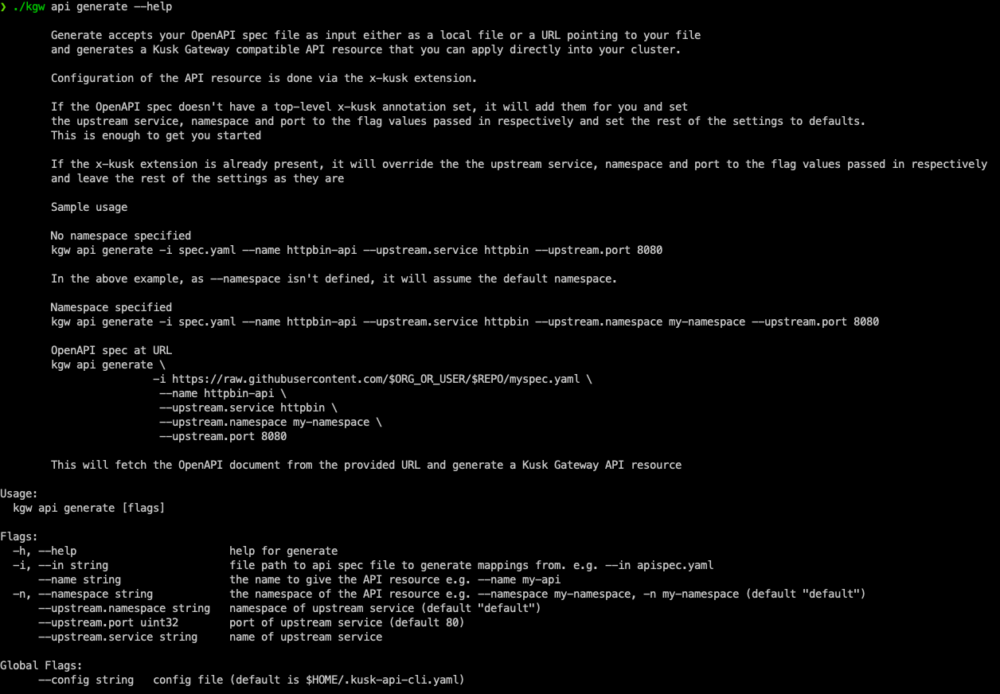

# Kusk Gateway CLI

[](http://makeapullrequest.com)

A CLI utility helper for creating Kusk Gateway API resources from your OpenAPI specification document.

 

---

# Table of contents

- [Usage](#usage)
  - [Flags](#flags)
  - [Example](#example)
- [Installation](#installation)
- [Updating](#updating)
- [Uninstallation](#uninstallation)
- [Contributing](#contributing)
- [License](#license)

# Usage

[(Back to top)](#table-of-contents)

## Flags
|          Flag          |                                             Description                                             | Required? |
|:----------------------:|:---------------------------------------------------------------------------------------------------:|:---------:|
|        `--name`        |                         the name to give the API resource e.g. --name my-api                        |     ✅     |
|  `--namespace` / `-n`  | the namespace of the API resource e.g. --namespace my-namespace, -n my-namespace (default: default) |     ❌     |
|      `--in` / `-i`     |       file path or URL to OpenAPI spec file to generate mappings from. e.g. --in apispec.yaml       |     ✅     |
|  `--upstream.service`  |                                 name of upstream Kubernetes service                                 |     ✅     |
| `--upstream.namespace` |                           namespace of upstream service (default: default)                          |     ✅     |
|    `--upstream.port`   |                        port that upstream service is exposed on (default: 80)                       |     ✅     |

## Example
Take a look at the [http-bin example spec](./examples/httpbin-spec.yaml)

```
kgw api generate -i ./examples/httpbin-spec.yaml --name httpbin-api --upstream.service httpbin --upstream.port 8080
```

The output should contain the following x-kusk extension at the top level
```
...
x-kusk:
  cors: {}
  path:
    rewrite:
      pattern: ""
      substitution: ""
  upstream:
    service:
	name: httpbin
	namespace: default
	port: 8080
```

# Installation

[(Back to top)](#table-of-contents)

## Homebrew
`brew install kubeshop/kusk/kgw`

## Go install the latest release on Github
`go install github.com/kubeshop/kgw@latest`

To install a particular version: replace `latest` with the version number

You can get a list of the available kgw versions from our [releases page](https://github.com/kubeshop/kgw/releases)

## Easy install script
This will install `kgw` into `/usr/local/bin/kgw`

On Linux, sudo rights are required to access `/usr/local/bin`. Please run with `sudo`.
```sh
bash < <(curl -sSLf https://github.com/kubeshop/kgw/blob/main/scripts/install.sh)
```

## From source
```
git clone git@github.com:kubeshop/kgw.git && \
cd kgw && \
go install
```

## Alternative installation method (manual)

If you don't like automatic scripts you can always use the manual install:

1. Download binary with version of your choice (recent one is recommended)
2. Upack it (tar -zxvf kgw_0.1.0_Linux_arm64.tar.gz)
3. Move it to a location in the PATH. For example `mv kgw_0.1.0_Linux_arm64/kgw /usr/local/bin/kgw`

For Windows, download the binary from [here](https://github.com/kubeshop/kgw/releases), unpack the binary and add it to `%PATH%`. 

# Updating

[(Back to top)](#table-of-contents)

## Homebrew
`brew upgrade kubeshop/kusk/kgw`

## Latest release on Github
`go install github.com/kubeshop/kgw@$VERSION`

## From source
Insde the kgw repository directory
```
git pull && go install
```

# Contributing

[(Back to top)](#table-of-contents)

Your contributions are always welcome! Please have a look at the [contribution guidelines](https://github.com/kubeshop/.github/blob/main/CONTRIBUTING.md) first.

# License

[(Back to top)](#table-of-contents)


[MIT](https://mit-license.org/). Please have a look at the [LICENSE](LICENSE) for more details.
